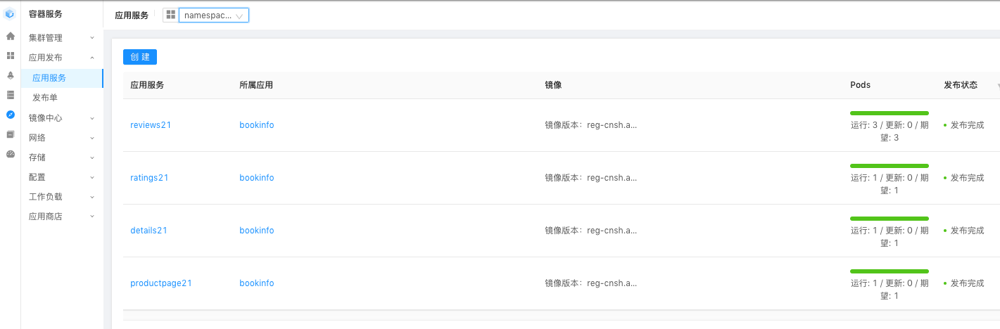
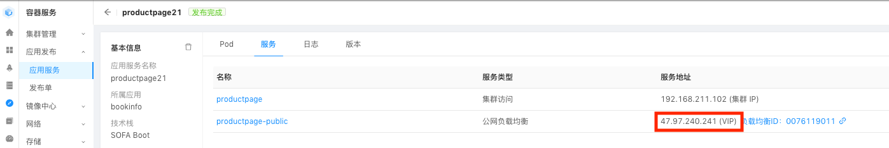

# 访问 BookInfo 应用

## 获知 SLB 的公网IP地址

在前面我们部署 BookInfo 的过程中，productpage 应用有配置负载均衡，我们需要获知这个SLB的公网IP地址以便后面通过浏览区访问 productpage 页面。

在左边的菜单中找到 "容器服务" 》 "应用发布" ，可以看到应用服务的列表。注意要选择对应的 namespace ，在下拉框找到和当前用户编号对应的 namespace。例如，如果用户名是 user21，则对应的 namespace 为 namespace2:

点击 “prodectpageN” 查看服务的详细情况，点击 "服务" tab ：

图中的IP地址就是 SLB 的公网IP地址，请记录该IP地址，后面我们将以 SLBIP 表示这个地址。

## 访问 productpage 页面

打开浏览器，访问地址 `http://SLBIP:19080`