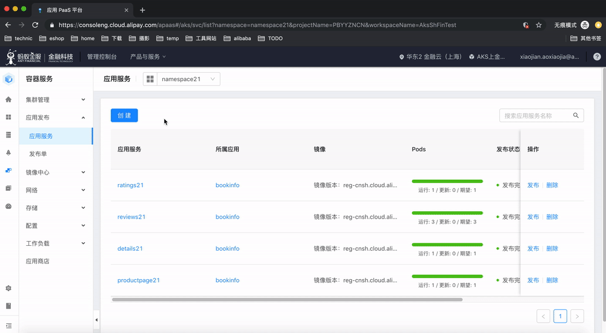
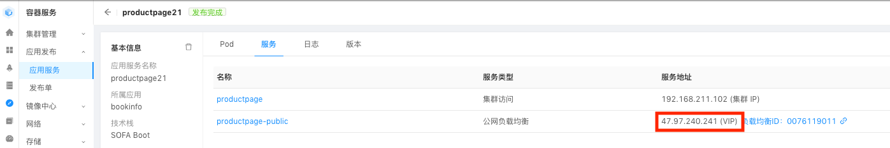

### 获知 SLB 的公网IP地址

在前面我们部署 BookInfo 的过程中，productpage 应用有配置负载均衡，我们需要获知这个SLB的公网IP地址以便后面通过浏览区访问 productpage 页面。



注意要选择对应的 namespace ，在下拉框找到和当前用户编号对应的 namespace。例如，如果用户名是 user21，则对应的 namespace 为 namespace21.

图中的IP地址就是 SLB 的公网IP地址，请记录该IP地址，后面我们将以 SLBIP 表示这个地址。



### 访问 productpage 页面

打开浏览器，访问地址 `http://SLBIP:19080/productpage?u=normal`，看到的页面如下：


### 模拟访问页面的流量

在后面进行灰度发布和流量监控的展示中，需要发起批量请求来模拟实际流量，我们提供了一个简单的bash脚本来完成这个事情。在我们分发的文件中有这个名为 auto_request.sh 的脚本文件。

也可以直接复制下面的内容保存为脚本文件：

```bash
#!/bin/bash  
if [ $# -ne 2 ]; then
    echo "Usage: ./auto_request.sh <url> <request times>"
    echo "Example: ./auto_request.sh www.xxx.com 10"
    exit 1
fi

for((i=1;i<=$2;i++)); 
do
echo request_$i 
curl -s $1 -o /dev/null
sleep 1s
done  
```

使用非常简单，指定url和访问次数，脚本会每秒中执行一次请求。下面的例子会执行30次请求：

```bash
./auto_request.sh http://SLBIP:19080/productpage?u=normal 30
```

