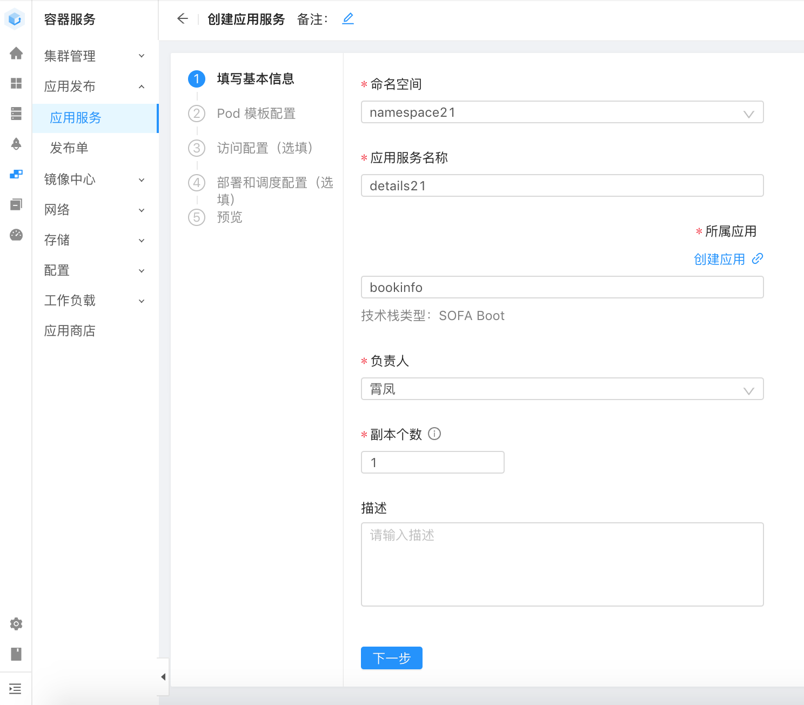
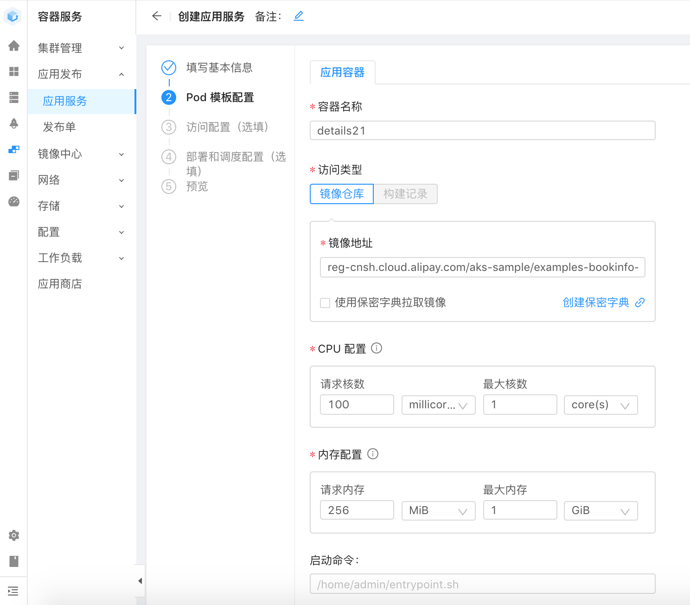
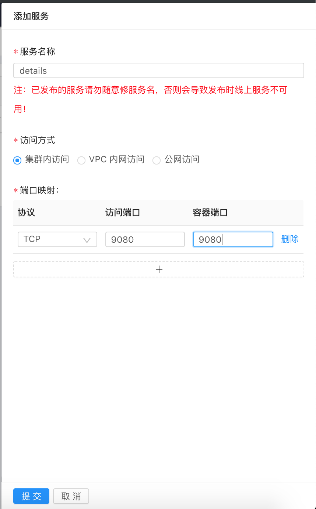
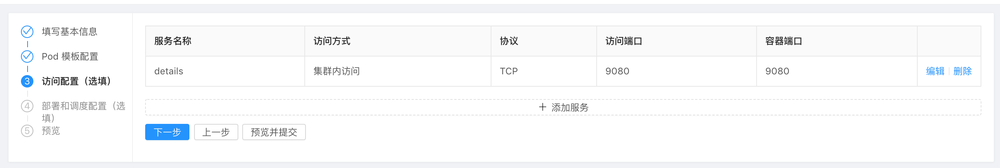
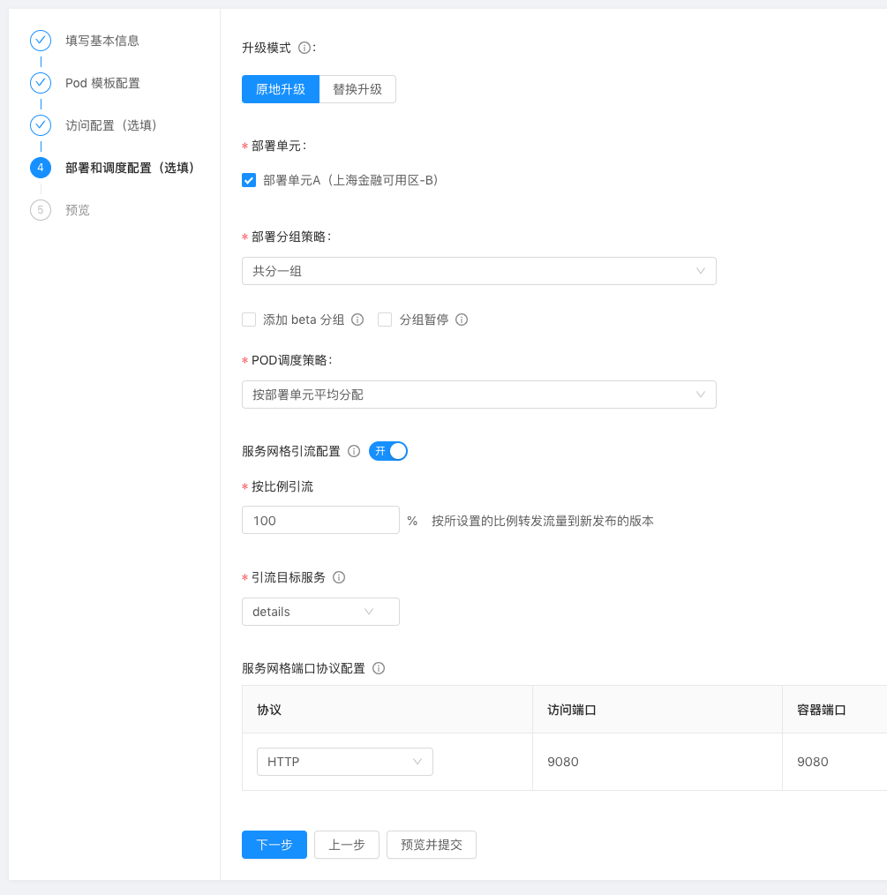
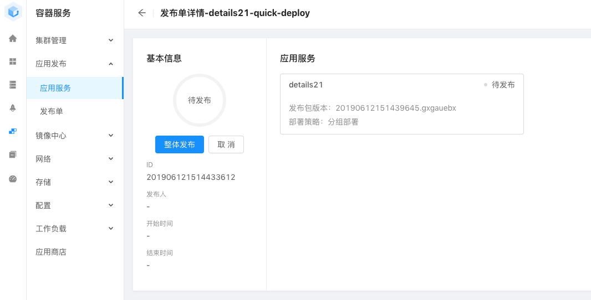
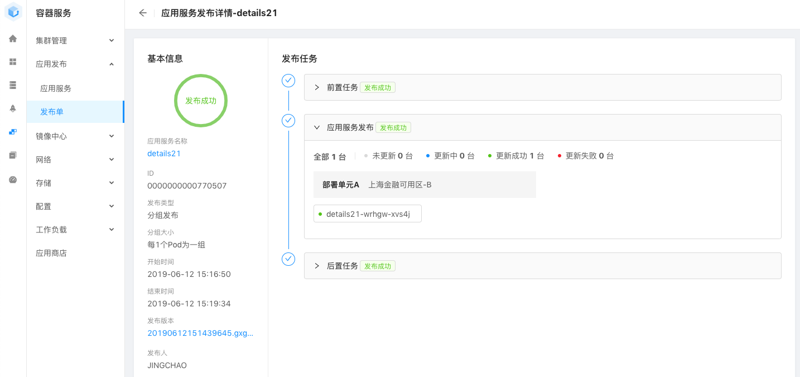
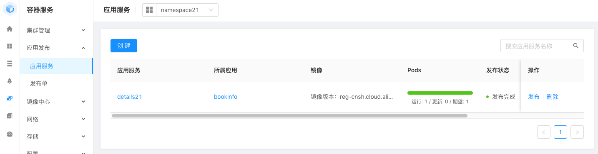

### 操作视频

以下是部署 details 应用的全程操作视频。

中间步骤的具体说明和需要特别注意的地方，请见下面详细的步骤说明。

需要用的镜像地址是：

reg-cnsh.cloud.alipay.com/aks-sample/examples-bookinfo-details-v1:1.10.1

### 操作步骤详解

点击"创建"按钮，开始创建 bookinfo 中的 details 应用。第一步，填写基本信息：

请注意：

- 请选择正确的命名空间（ namespace+用户编号），请注意核对
- 应用服务名称请填写 "details" + 用户编号，如图中的 "details21" （否则可能会和其他人建立的应用重名而发生冲突）
- 所属应用请选择 bookinfo
- 副本个数：请设置为1，demo中除了 reviews 应用外其他应用都只需要一个副本

第二步，Pod 模版配置：

- 容器名称默认为 details + 编号，注意这个容器名称是在整个workspace内要求唯一，而不仅仅是当前 namespace 之内，因此编号是必须的

- 镜像我们已经准备好，地址为：

	reg-cnsh.cloud.alipay.com/aks-sample/examples-bookinfo-details-v1:1.10.1

- CPU配置请注意修改默认配置，默认的请求核数为 1 core，建议修改为 100 millicore

- 内容配置请注意修改默认配置，默认的请求内存为 1 G，建议修改为 256M

- 高级配置可以不用配置，默认即可

第三步，创建访问配置：

点击"添加服务"，添加 reviews 服务作为集群内访问使用：

- 服务名称：特别注意这里要填写为 details ，不要后缀编号！不要后缀编号！不要后缀编号！
- 访问方式：集群内访问
- 端口映射：添加一个，如图所示，协议为TCP，访问端口和容器端口都是 9080 

访问配置设置好的样子：

下一步，部署和调度配置：

注意开启 "服务网格引流配置"，第一次部署时，直接100%引流到目标服务即可。

在预览界面，确认无误，点击提交。在应用服务创建成功的提示下，选择 "立即发布"，此时会创建发布单：

点整体发布，进入"发布中" 状态之后，可以点图中的应用服务，进入查看详细的发布情况，并等待发布完成：

- 如果遇到报错，”后置任务”中的”发布日志配置”失败，请点击忽略即可。

此时再进入应用服务列表页面，就能看到刚发布成功的 details 应用：

