### 操作视频

以下是部署 productpage 应用的全程操作视频。

中间步骤的具体说明和需要特别注意的地方，请见下面详细的步骤说明。

需要用的镜像地址是：reg-cnsh.cloud.alipay.com/aks-sample/examples-bookinfo-productpage-v1:1.10.1

### 操作步骤详解

点击"创建"按钮，开始创建 bookinfo 中的 productpage 应用。第一步，填写基本信息：

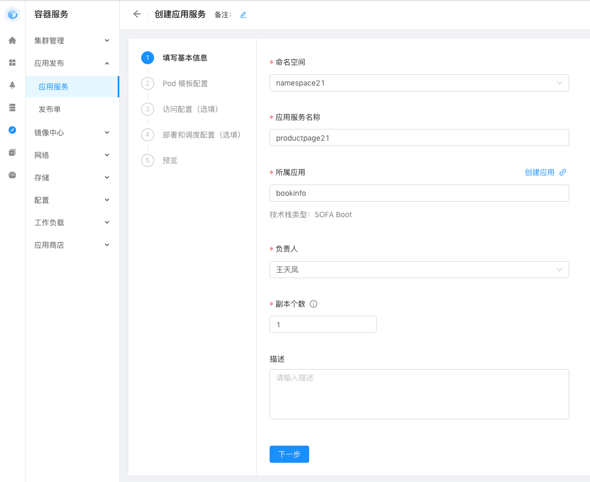

请注意：

- 请选择正确的命名空间（ namespace+用户编号），请注意核对
- 应用服务名称请填写 "productpage" + 用户编号，如图中的 "productpage21" （否则可能会和其他人建立的应用重名而发生冲突）
- 所属应用请选择 bookinfo
- 负责人随意
- 副本个数：请设置为1，demo中除了 reviews 应用外其他应用都只需要一个副本

第二步，Pod 模版配置：

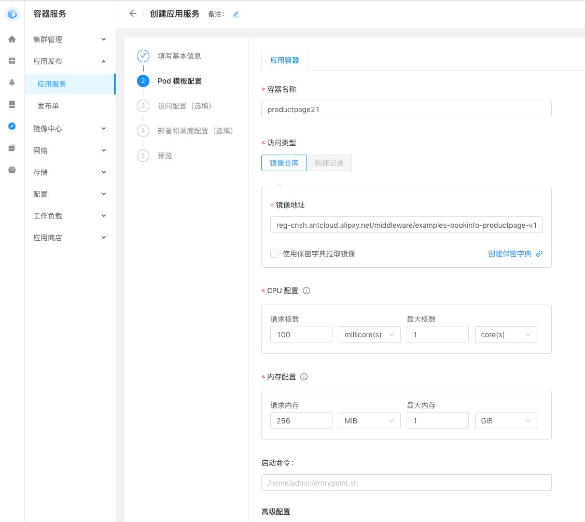

- 容器名称默认为 productpage + 编号，注意这个容器名称是在整个workspace内要求唯一，而不仅仅是当前 namespace 之内，因此编号是必须的

- 镜像我们已经准备好，地址为：

	reg-cnsh.cloud.alipay.com/aks-sample/examples-bookinfo-productpage-v1:1.10.1

- CPU配置请注意修改默认配置，默认的请求核数为 1 core，建议修改为 100 millicore

- 内容配置请注意修改默认配置，默认的请求内存为 1 G，建议修改为 256M

- 高级配置可以不用配置，默认即可

第三步，创建访问配置：

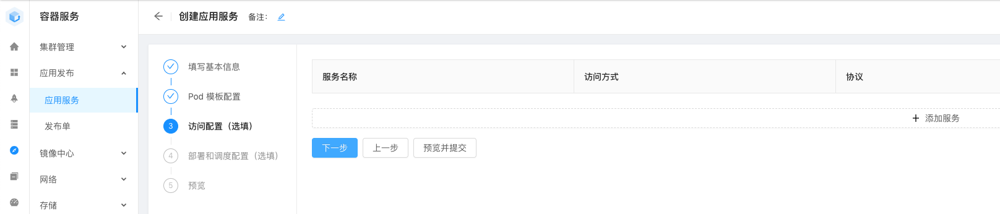

点击"添加服务"，productpage比较特殊，需要添加两个服务，先添加 productpage 服务作为集群内访问使用：

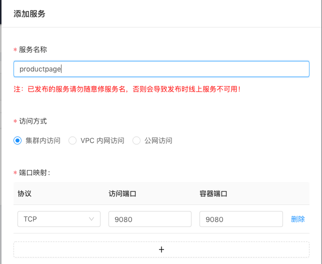

- 服务名称：特别注意这里要填写为 productpage ，不要后缀编号！不要后缀编号！不要后缀编号！
- 访问方式：集群内访问
- 端口映射：添加一个，如图所示，协议为TCP，访问端口和容器端口都是 9080 

再添加 productpage-public 服务作为公网访问使用，注意协议一定要选择 HTTP：

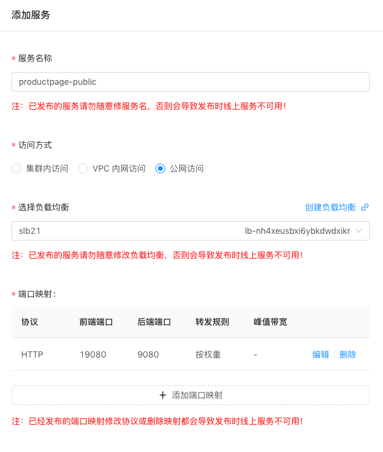

- 服务名称：请固定使用 productpage-public 
- 访问方式：选公网访问
- 选择负载均衡：这里我们已经创建好了 SLB，请在下拉菜单中选择对应变化的 SLB，如图中的 slb21
- 端口映射需要添加一个，如下图所示

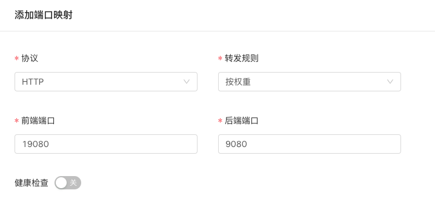

- 协议：注意协议一定要选择 HTTP！一定要选择 HTTP！一定要选择 HTTP！
- 转发规则：默认按权重
- 前端端口：19080，这是公网访问时的端口，后面我们会使用这个端口从公网进行访问
- 后端端口：9080，这是前面 productpage 服务的端口

访问配置设置好的样子：

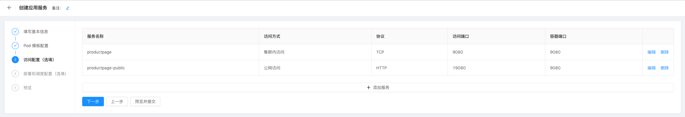

下一步，部署和调度配置：

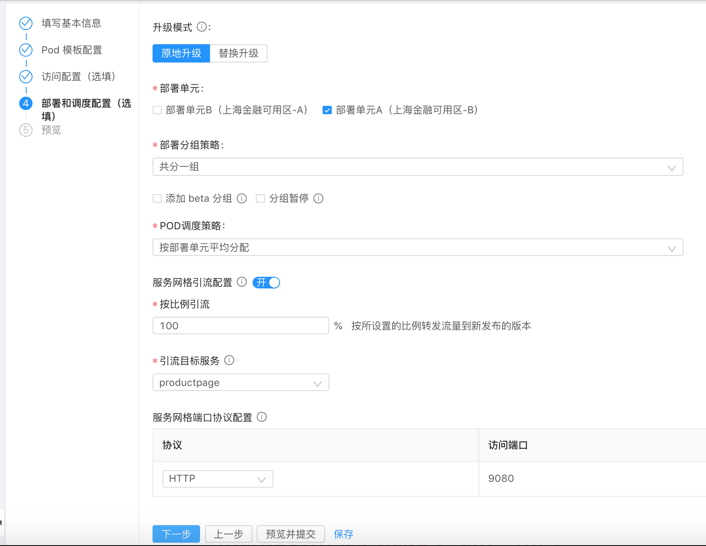

注意开启 "服务网格引流配置"，第一次部署时，直接100%引流到目标服务即可。

在预览界面，确认无误，点击提交。在应用服务创建成功的提示下，选择 "立即发布"，此时会创建发布单：

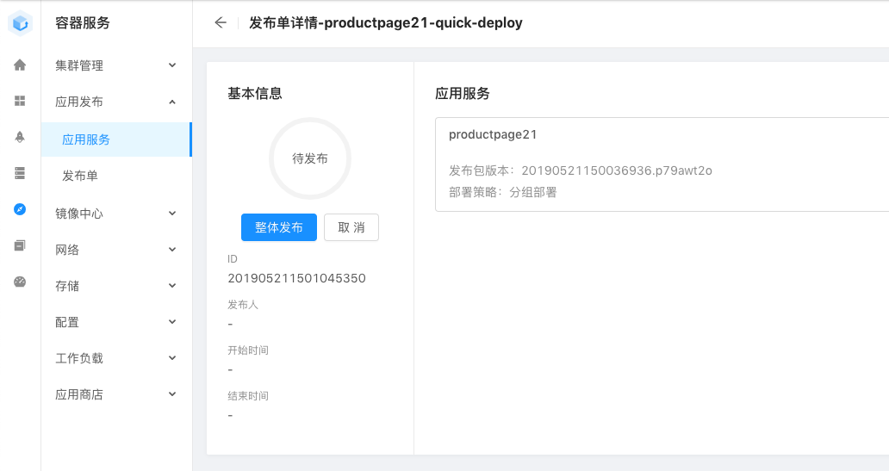

点整体发布，进入"发布中" 状态之后，可以点图中的应用服务，进入查看详细的发布情况：

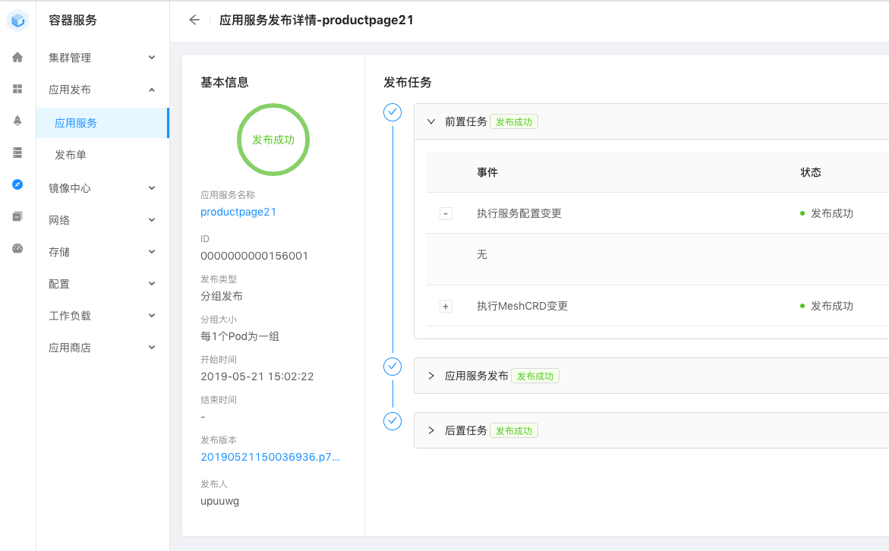

如果遇到报错：“Task CREATE-[INTERNET_LOAD_BALANCER_SERVICE-productpage-public] failed as no load balancer status of service namespace21/productpage-public”，请重试。

如果遇到报错，"后置任务"中的"发布日志配置"失败，请点击忽略即可。

此时再进入应用服务列表页面，就能看到刚发布成功的 productpage 应用：

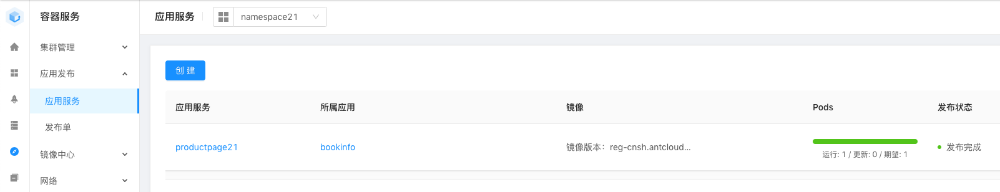

