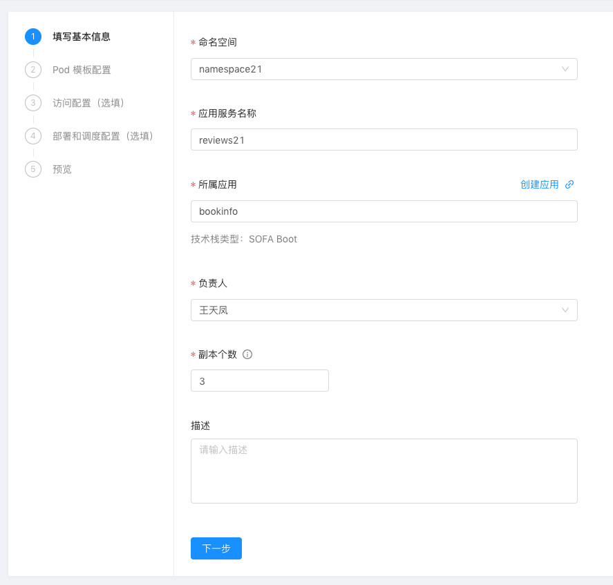
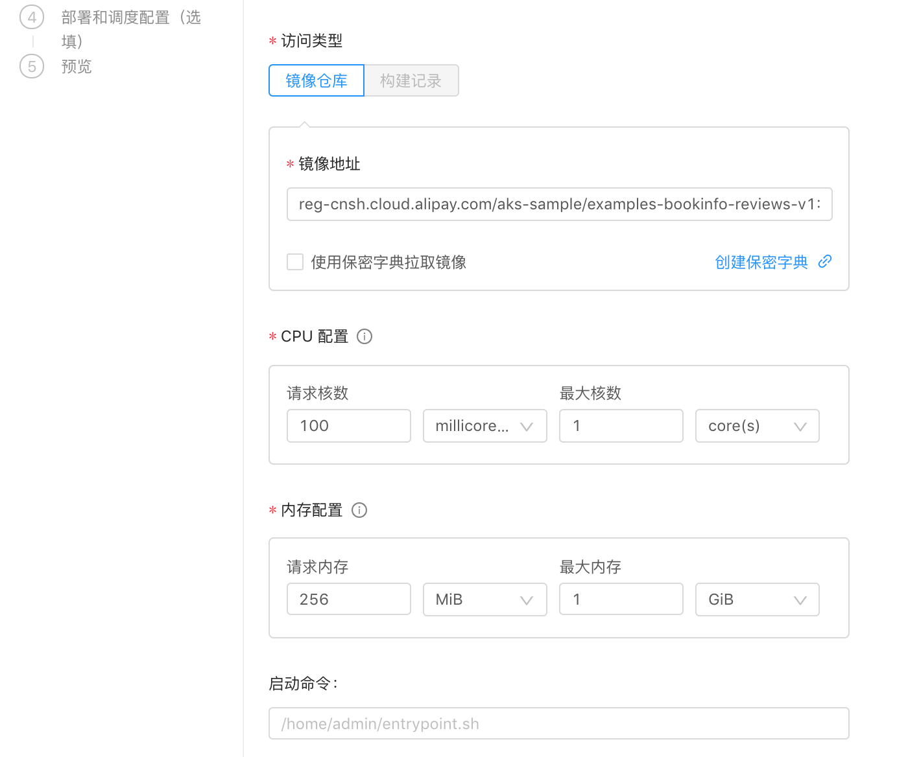
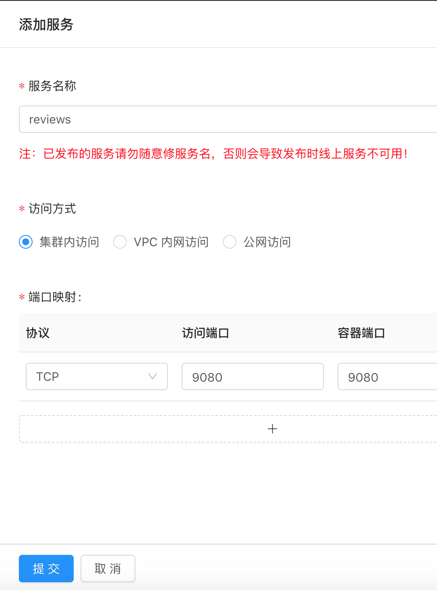
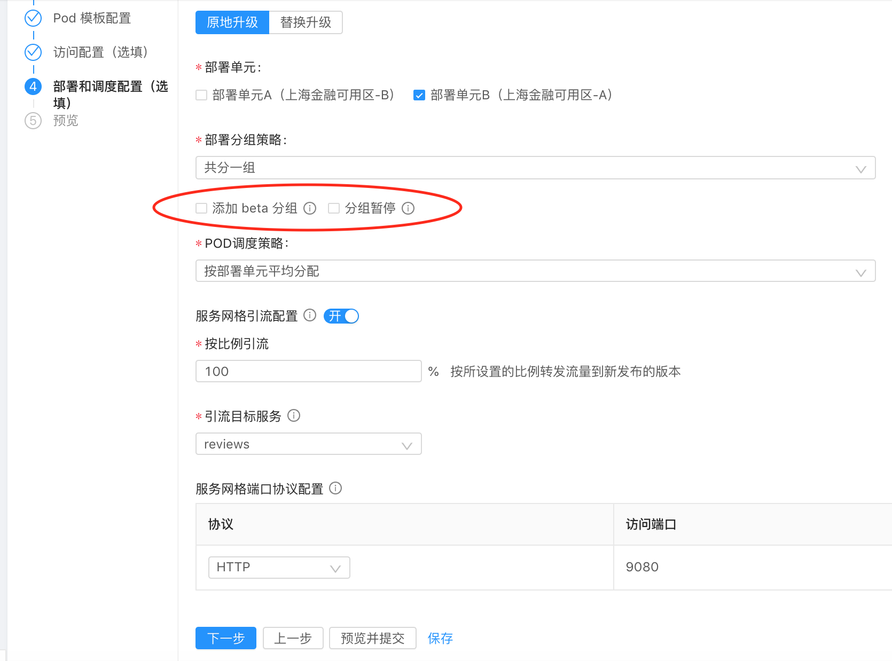

### 操作视频

以下是部署 reviews 应用的全程操作视频：

- 第一次部署时，我们将 reviews 服务部署为 v1 版本
- reviews 服务的副本数我们设置为 3 ，方便后面进行灰度发布

需要用的镜像地址是：

reg-cnsh.cloud.alipay.com/aks-sample/examples-bookinfo-reviews-v1:1.10.1

### 操作步骤详解

注意 reviews 的副本数设置为 3.

镜像地址：reg-cnsh.cloud.alipay.com/aks-sample/examples-bookinfo-reviews-v1:1.10.1

添加服务时，只需要添加一个 reviews 服务即可，切记 服务名称是 reviews， 不带编号。

部署时，"添加beta分组" 和 "分组暂停" 注意不要选，这个新建时不需要，后面灰度发布时用。

