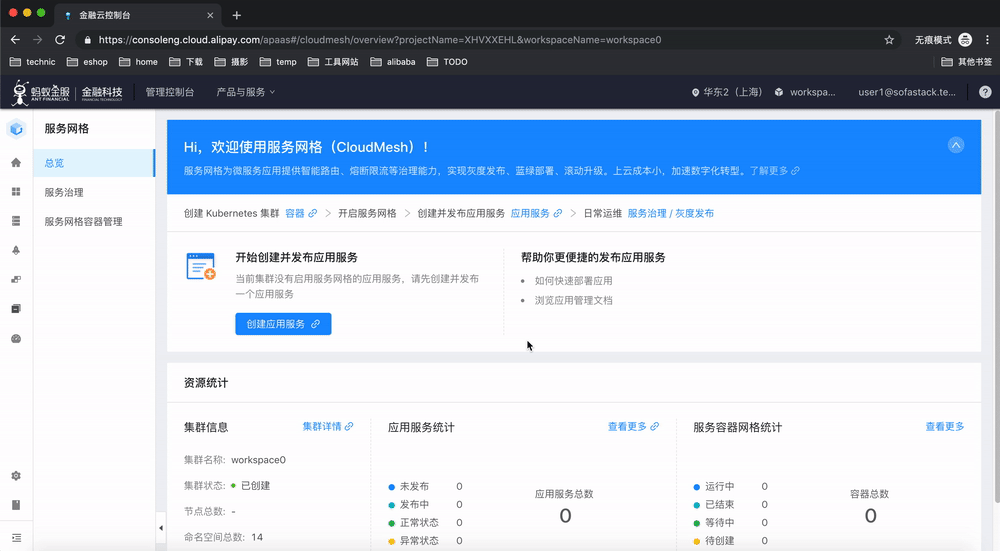
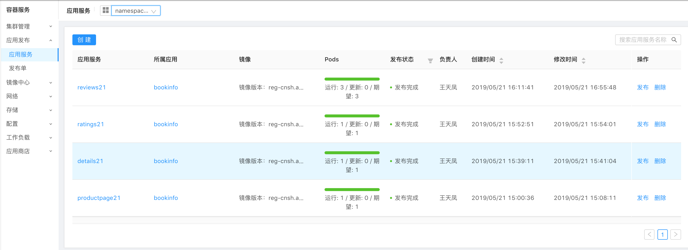

### 进入应用发布页面

进入应用发布页面的方式有两种：

1. 直接在总览页面，点击"创建应用服务"
2. 在左边的菜单中找到 "应用发布"，点击进去，在应用列表中点 "创建"

在应用服务列表页面和创建服务的页面中，都可以通过图中的 namespace 下拉菜单选择所在的 namespace，在本次 demo 中，每个用户都有自己独有的命令空间，名字后缀的编号和用户名编号一致，如 user1对应ns0，user21 对应 ns21。

### 发布四个应用

下面我们逐个展示如何创建 BookInfo 下的四个应用，请按照下面的指南依次发布：

- [部署details应用](bookinfo-details.html)
- [部署reviews应用](bookinfo-reviews.html)
- [部署ratings应用](bookinfo-ratings.html)
- [部署productpage应用](bookinfo-productpage.html)

### 发布完成

在上述四个应用发布完成之后，bookinfo 的四个应用如下图所示：

下一步我们来通过SLB来访问 bookinfo。