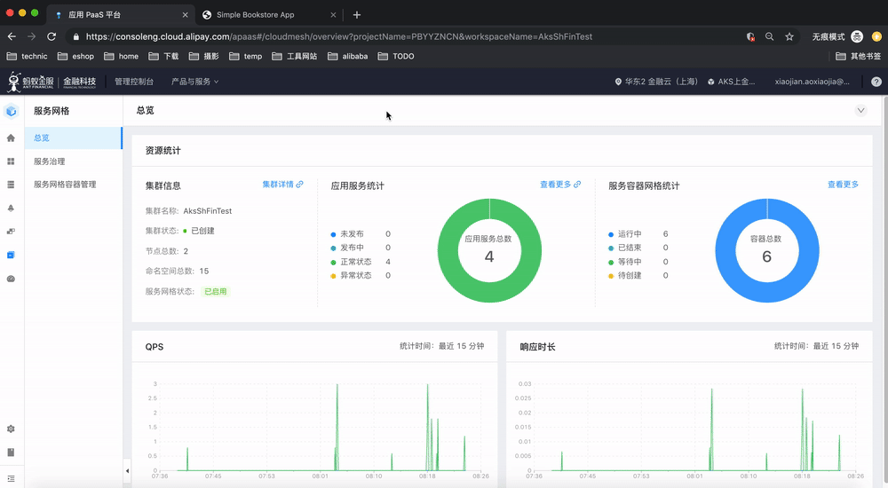
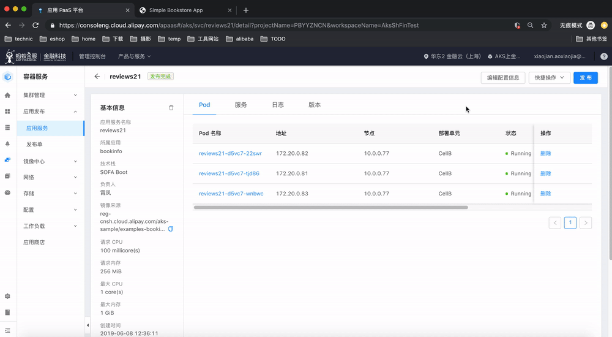
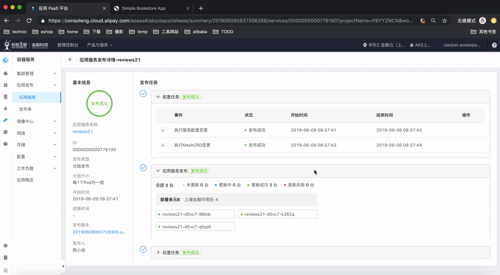

### 准备工作和版本说明

- 进入应用发布页面，选择准备发布的服务，如我们选择 reviews
- 打开浏览器访问 Bookinfo 应用，具体方式参照 [访问BookInfo应用](access.html) 一节 
- 用我们提供的脚本，尝试发起几次请求，后面要用它来模拟流量

我们接下来将对 reviews 服务进行版本更新，并在更新过程中进行灰度引流。我们将通过脚本产生流量，并通过观察页面 reviews star 的显示来判断版本，配合监控信息中的流量占比就可以感受到灰度发布的效果。

### 开始发布v2版本

注意事项：

-  发布新版本的入口在 "编辑配置信息" 按钮
- 进入 "Pod 模版配置"，在镜像地址栏中，将"examples-bookinfo-reviews-v1" 中的 "v1"  修改为 "v2"
- 重点在部署分组策略的配置：
	- 部署分组策略：选择 "每个pod一组"，reviews 服务的副本数为3，这样分布过程中就会分成3组，每组一个pod
	- 勾选 "添加 beta分组" 和 "分组暂停"： 这样在发布过程中，每个分组发布OK之后，都会暂停，需要确认才会进行下一组的发布，方便我们在过程中进行灰度引流的设置
	- 打开"服务网格引流配置"，选择目标服务为 reviews，初识化为 10%，即10%的流量去v2版本

### 第一组发布完成后的确认

在发布过程中，当第一台 pod 更新完成时，发布程序会暂停，页面 "Beta确认" 按钮和 "灰度引流" 按钮，请点击"灰度引流"按钮进入：

过程中我们将通过浏览器反复访问 bookinfo 页面，然后观察 rating star 的出现频率感受灰度发布的效果，最后通过脚本模拟浏览然后观察监控信息中显示的灰度流量占比。

点击 "取消" 关闭，然后在发布页面点击 "Beta确认" 以继续发布流程。

### 第二组发布完成后的确认

发布流程会进行第二组的更新，也就是更新第2个pod为新版本，当更新成功之后，会再次要求确认：

这是发布流程的最后一次暂停了，下一步就会全部更新为灰度版本，因此最后我们要设置为 100% 的灰度流量。

点击 "取消" 关闭，然后在发布页面点击 "Beta确认" 以继续发布流程。

### 发布完成

发布完成之后，再访问页面，则页面上的 reviews 信息会一直显示 v2 的内容（显示黑色 star），此时原来 v1 的3个 pod 全部更新为 v2 版本。

大家也可以尝试将 reviews 服务版本升级为 v3，再次体验灰度发布。