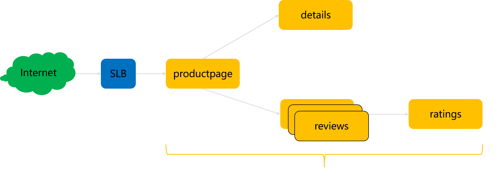
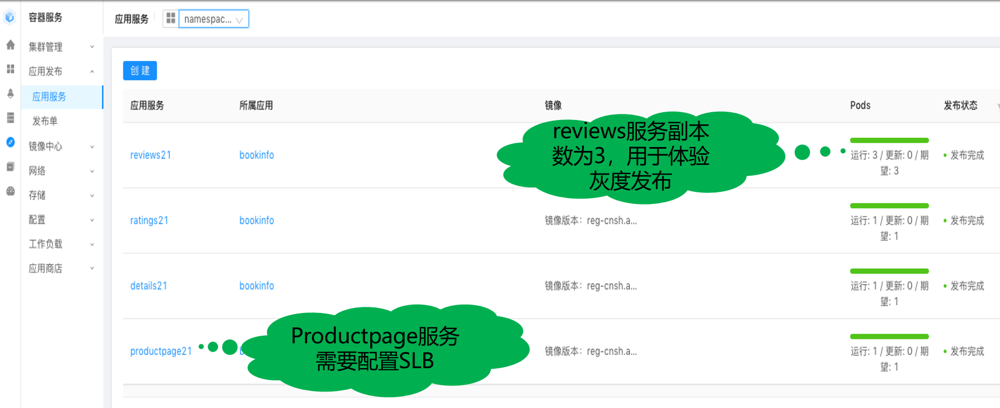
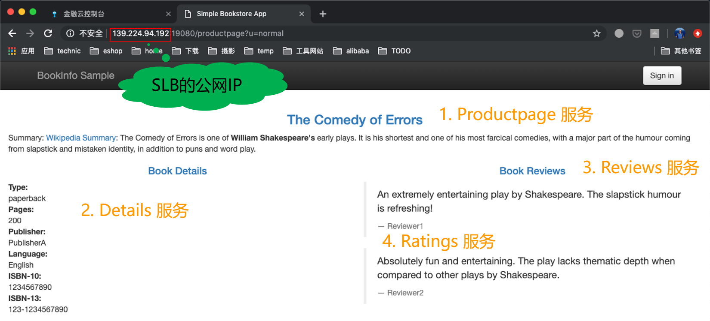
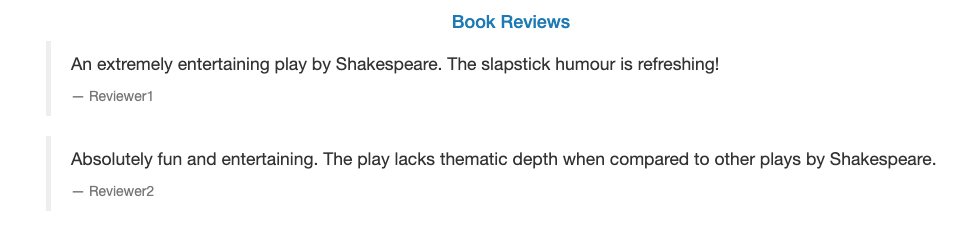
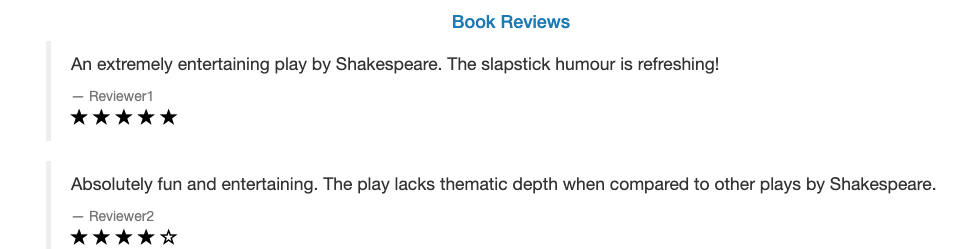
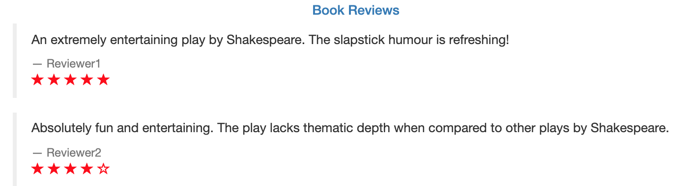

这次 demo 我们采用的是 Istio 官方的 BookInfo 示例，之所以选择这个例子，是因为考虑到大部分对 Service Mesh 和 Istio 有了解的同学，都对 BookInfo 示例比较熟悉。

BookInfo 示例由四个应用组成：

- productpage：用于显示页面的服务，对外暴露，我们会准备SLB来让大家可以从公网访问到这个应用
- details：提供book的详细资料
- reviews：提供book的评论，会有v1/v2/v3三个版本，用来演示发布应用的新版本
- ratings：提供book的评分

发布完成之后的样子如图，reviews 应用我们设置副本数为3，其他服务的副本数都是1。

下图是用浏览器通过SLB访问 BookInfo 示例的页面和四个服务在页面上对应的信息：

其中 reviews 服务有三个版本，页面显示会有差别：

| 版本 | 页面效果                                   |
| ---- | ------------------------------------------ |
| v1   |   没有 star |
| v2   |   黑色 star |
| v3   |  红色 star  |

在demo时我们将通过观察star的显示情况来判断当前请求访问的是 reviews 的哪个版本。

