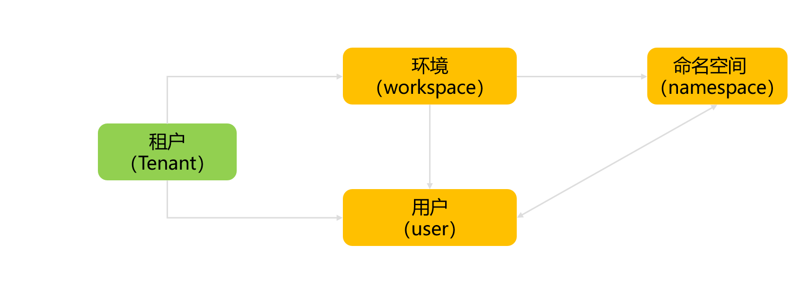
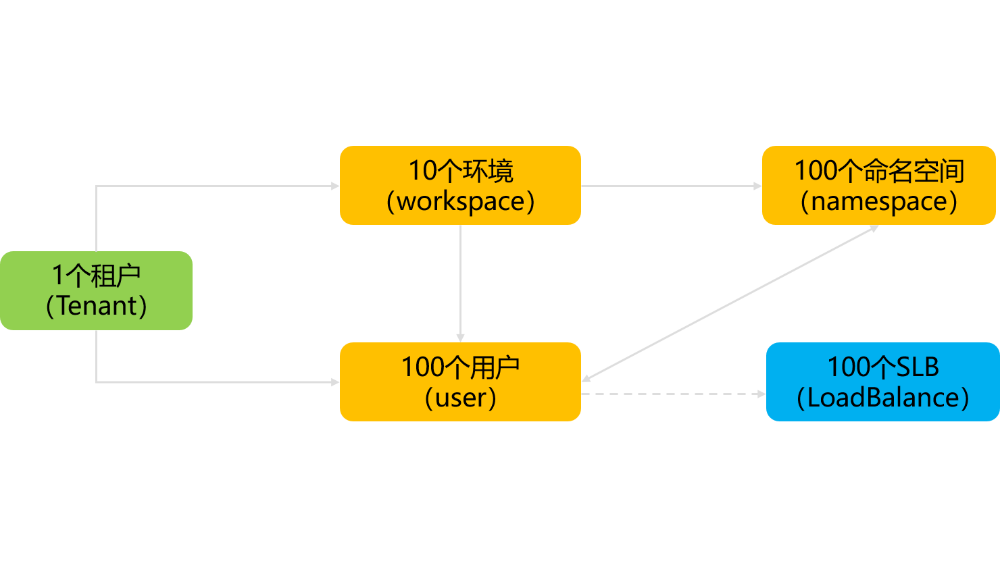
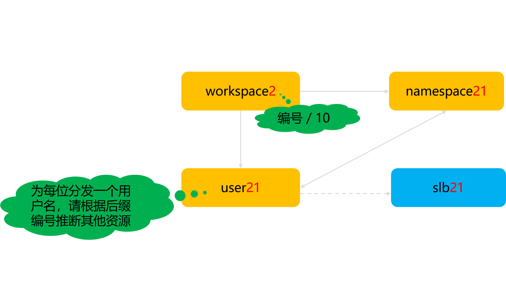

# Demo环境准备

### 金融云用户模型

金融云有租户的概念，每个租户下可以开通多个用户，建立多个环境（workspace），每个workspace 下可以建立多个 namespace。

在这次demo中，我们将共有一个 租户，然后为每个参加demo的同学预先创建一个用户和namespace。workspace 则是每10个同学共享一个 workspace。

由于共处一个租户，所以用户之间并不需要完全隔离，这一点稍有特殊，会对后面的操作有些小影响。

### Demo分配的资源

在demo前，我们会预先准备好资源。

每位用户在开始demo前都将分配 用户名 和 登录密码，以及我们为您提前准备好的其他资源。我们会在现场分发用户等资料，如果没有拿到资料请联系现场支持人员。

### 命名规则

为了让大家拿到的资源不一致混乱，我们有如下的命名规则。每位用户都有一个固定的用户编号，如 user21 的编号就是 21，然后根据用户编号就可以确认其他资源的名称。命名规则和资源的对应关系如下表：

| 用户名          | workspace  | namespace | slb  |
| --------------- | ---------- | --------- | ---- |
| user0 - user9   | workspace0 | nsN       | slbN |
| user10 - user19 | workspace1 | nsN       | slbN |
| user20 - user29 | workspace2 | nsN       | slbN |
| user30 - user39 | workspace3 | nsN       | slbN |
| user40 - user49 | workspace4 | nsN       | slbN |
| user50 - user59 | workspace5 | nsN       | slbN |
| user60 - user69 | workspace6 | nsN       | slbN |
| user70 - user79 | workspace7 | nsN       | slbN |
| user80 - user89 | workspace8 | nsN       | slbN |
| user90 - user99 | workspace9 | nsN       | slbN |

以 user21为例，对应的 workspace / namespace / slb 分别为 workspace2 / ns21 / slb21 。

即对于 userN，对应的 workspace / namespace / slb 分别为 workspace(N/10) / nsN / slbN 。

