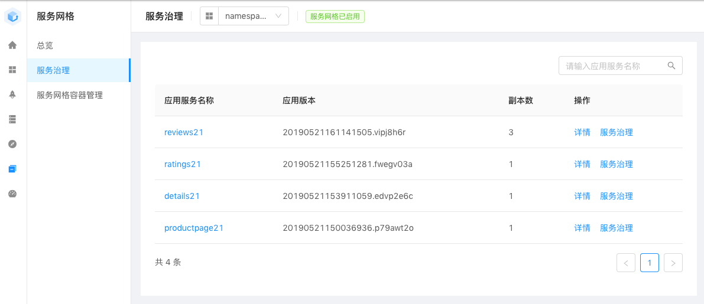
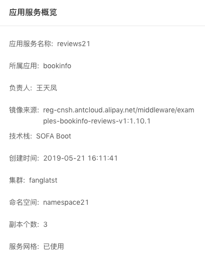
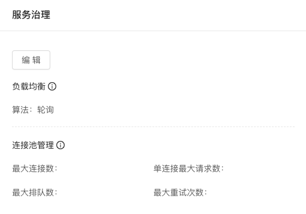
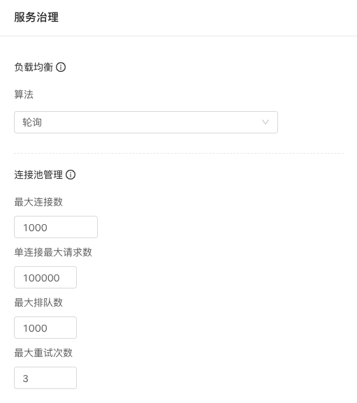

# 服务治理

在左边菜单中找到 "服务网格" 》"服务治理"，然后在上面的 namespace 下拉菜单中选择和当前用户名对应的 namespace（userN 对应 namespaceN）：

应用服务列表页面列出了我们前面创建的 bookinfo 下的四个应用。点击 "应用服务名称" 或者 "详情" 可以查看当前服务的详细情况：

点击 "服务治理" 显示如下，默认没有配置则各项参数会使用默认值 （可以点图中 i 图标查看具体的配置说明和默认值）：

点击 "编辑" 进行服务治理的设置界面：

提交稍等即可生效。