# 灰度发布

### 打开 productpage 页面

> 备注：如何通过公网地址访问 productpage 服务，请见前面的 [访问BookInfo应用](access.md) 一节 

在这个页面中，我们通过SLB访问了 productpage 服务，然后 productpage 服务访问了 detais 服务（左边显示内容）和 reviews 服务 （右边显示内容）。

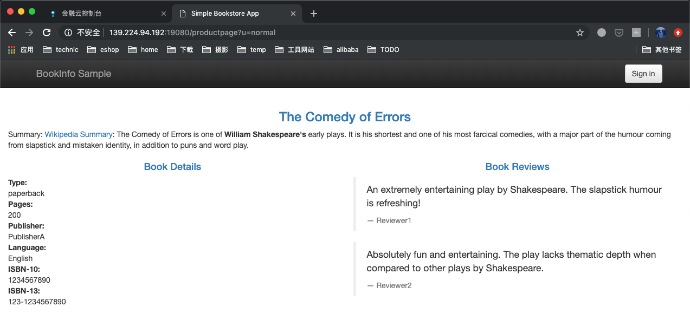

我们接下来将对 reviews 服务进行版本更新，并在更新过程中进行灰度引流。这会涉及到 reviews 服务的两个版本：

- reviews v1: 不带 rating 信息，所以 reviews 信息里面没有 star 显示，如下图所示

	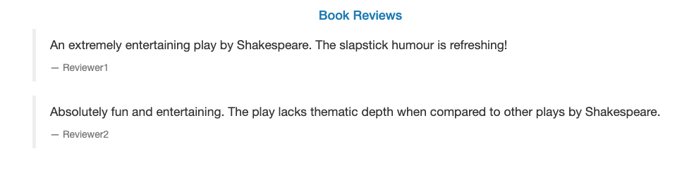

- reviews v2: 带 rating 信息，所以 reviews 信息里面有黑色的 star 显示出来，如下图所示

	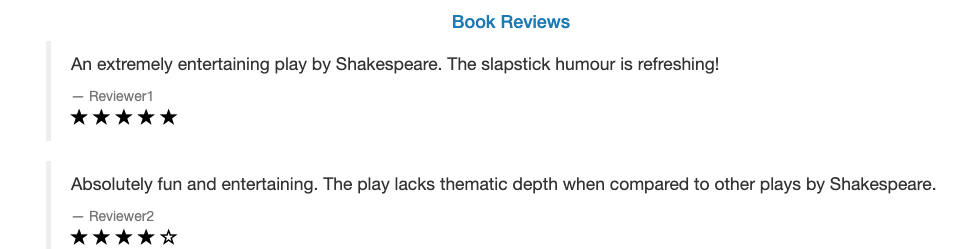

请注意对比这个页面的细节，后面我们将把 reviews 服务的版本从初识发布时的 v1 升级为 v2，并在升级过程中实现灰度发布。我们将通过浏览器访问来产生流量，并通过观察页面 reviews star 的显示来判断出来是 v1 版本还是 v2 版本，多次刷新之后就会对 v1 和 v2 的比例有一个感性的认知，然后配合监控信息中的流量占比就可以感受到灰度发布的效果。

### 开始发布v2版本

在 应用服务列表页面，找到 `reviews**` 应用服务，点击进去可以看到服务的各种信息。我们现在来更新服务的镜像到v2版本，点击右上角红色框内的 "编辑配置信息" 按钮：

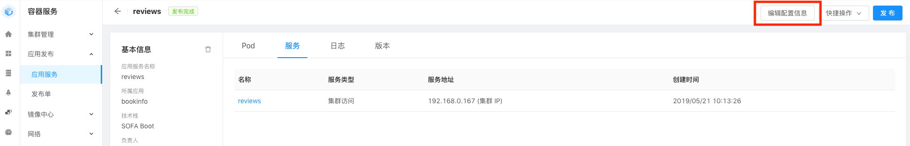

基本信息不用修改，点"下一步" 进入 "Pod 模版配置"，在镜像地址栏中，将"examples-bookinfo-reviews-v1" 中的 "v1"  修改为 "v2":

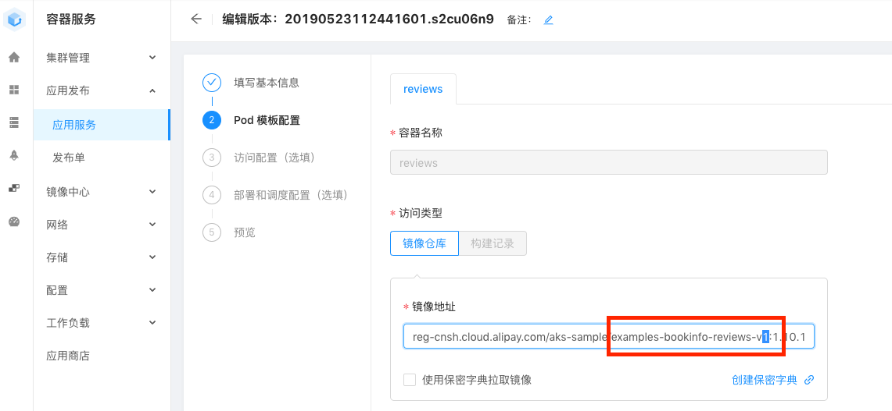

下一步"访问配置"不用修改，再下一步进入部署和调度配置，设置如下：

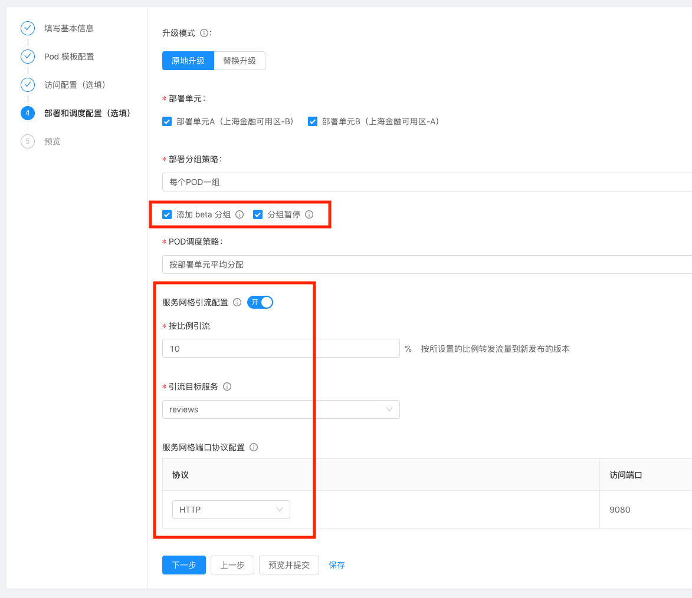

- 部署分组策略：选择 "每个pod一组"，reviews 服务的副本数为3，这样分布过程中就会分成3组，每组一个pod
- 勾选 "添加 beta分组" 和 "分组暂停"： 这样在发布过程中，每个分组发布OK之后，都会暂停，需要确认才会进行下一组的发布，方便我们在过程中进行灰度引流的设置
- 打开"服务网格引流配置"，选择目标服务为 reviews，比例我们初识化为 10%

点击下一步，然后开始提交修改并开始发布流程。

### 第一组发布完成后的确认

在发布过程中，当第一台 pod 更新完成时，发布程序会暂停，页面出现下图中的 "Beta确认" 按钮和 "灰度引流" 按钮：

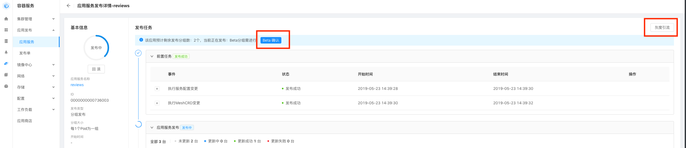

我们点 "灰度引流" 按钮，打开如下图的灰度引流配置，为了产生流量，我们需要连续点击浏览器的刷新按钮，人工制造请求 productpage 页面的流量，在点击的过程中，下图中的监控信息会实时更新，当点击量（流量）累计一点程度时，就可以看到灰度版本的流量占比和主版本的流量占比。

如下图，我们初识设定的灰度流量占比是 10%，经过反复刷新页面产生流量访问之后，累计出来的流量统计信息是灰度流量达到 8% （会有轻微的误差，因为我们手工点击产生的流量不够密集）：

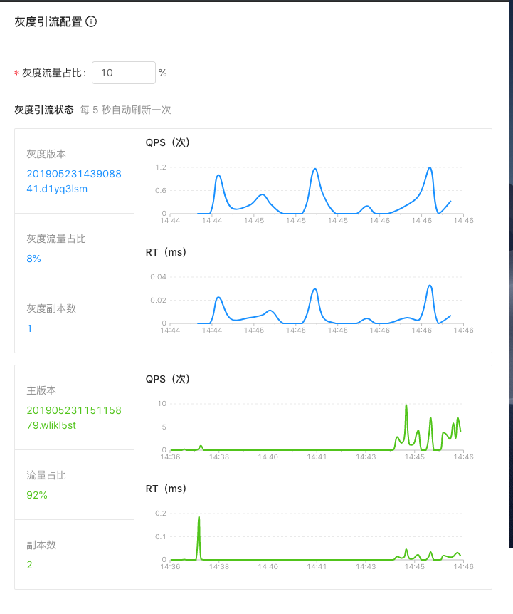

刷新的过程中，也可以通过观察页面显示的 reviews 内容来判断是否有访问到 v2 版本：如果访问 v2 版本，则页面会显示 rating 的star。由于 v2 占比为 10%，所以下面的 star 只会偶尔出现，请连续刷新页面：

我们可以在这里修改 "灰度流量占比"，如从 10% 修改为 50%，然后点击 "提交" 以生效新的设置，然后再次连续刷新浏览器来产生流量，注意观察下面的统计信息：

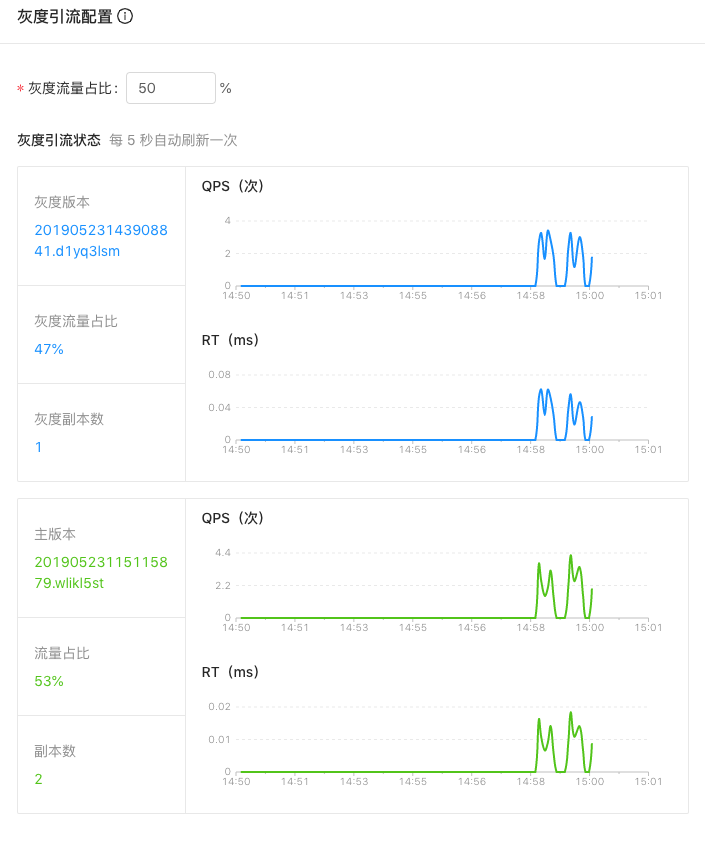

修改 "灰度流量占比" 为 50%之后，页面 reviews 信息显示 star 的概率就会变成 50%，很容易体验到灰度的效果。

点击 "取消" 关闭，然后在发布页面点击 "Beta确认" 以继续发布流程。

### 第二组发布完成后的确认

发布流程会进行第二组的更新，也就是更新第2个pod为新版本，当更新成功之后，会再次要求确认：

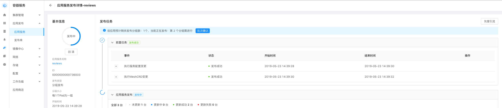

再次点击 "灰度引流" 按钮，打开如下图的灰度引流配置，注意此时"灰度副本数"为2，即第二个pod已经更新为新版本。我们再次手工发起流量访问，然后查看监控信息可以看到下图中灰度流量占比和主版本占比大体是 1: 1 。

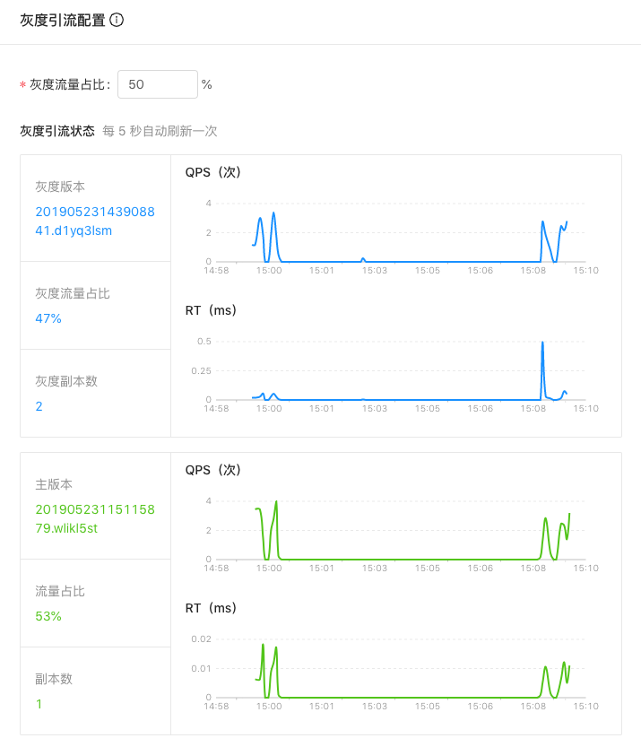

将 "灰度流量占比" 修改为 100%，提交之后再次反复刷新页面。页面信息应该每次都显示 reviews 带有 star ，监控也应该显示：

TBD：还缺一个图片，100% 灰度流量

点击 "取消" 关闭，然后在发布页面点击 "Beta确认" 以继续发布流程。

### 发布完成

发布完成之后，再访问页面，则页面上的 reviews 信息会一直显示 v2 的内容（显示star），因为此时原来 v1 的3个 pod 全部更新为 v2 版本。