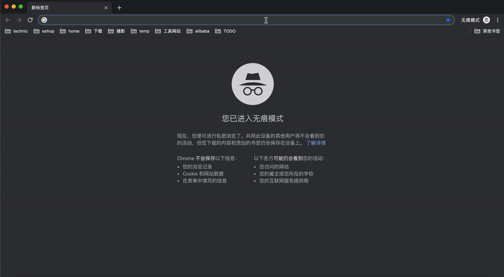

# 登录

每位用户在开始demo前都将分配 用户名 和 登录密码，以及我们为您提前准备好的其他资源。

### 登录操作

登录地址：

https://consoleng.cloud.alipay.com/apaas#/cloudmesh/overview

请使用浏览器打开，并请使用我们提供的 用户名/密码 登录，登录过程中需要选择对应的 workspace：

登录成功之后，进入 服务网格 的控制台，能看到当前服务网格的总览情况，我们可以看到 服务网格功能已经开启。

但是当前没有应用，因此我们继续进行下一步，应用创建。